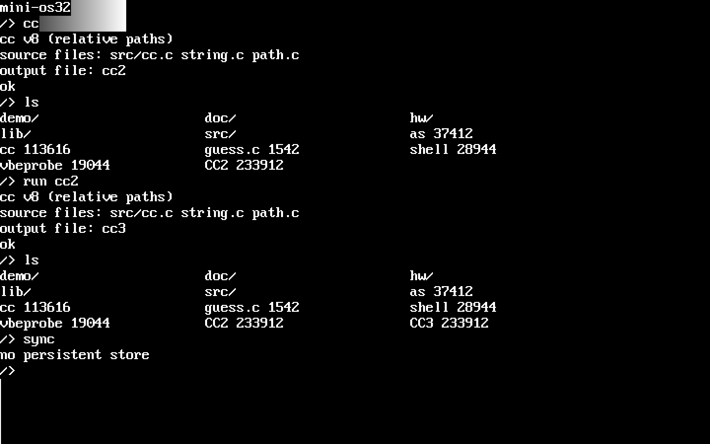
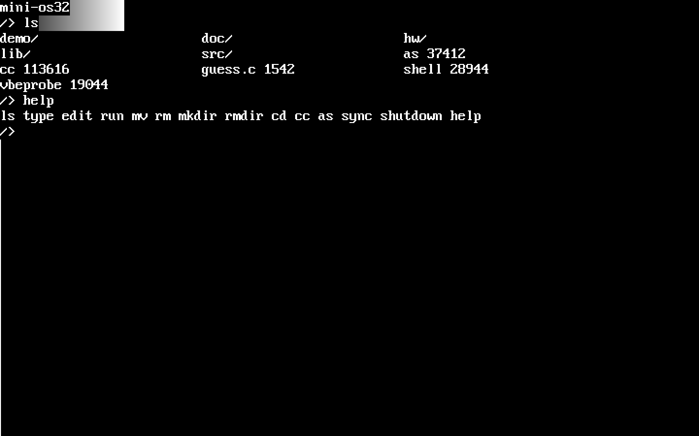

# mini-os32

A 32-bit x86 operating system written from scratch in C and assembly, with its own C compiler that is self-hosting: `cc` running inside the OS compiles its own source, and the compiler it produces compiles that source again to a byte-identical binary.



Part of a "transistors to transformers" body of work. See also [custom-16bit-CPU](https://github.com/Waelalzoub1/custom-16bit-CPU) (a CPU built from NAND gates) and [Transformer-character-level](https://github.com/Waelalzoub1/Transformer-character-level) (a transformer written from scratch in PyTorch).

## What is here

| Component | Files | Code lines |
|---|---|---|
| BIOS boot: MBR loader, stage 2 with VESA mode selection | `boot/boot.S`, `boot/stage2.S` | 523 |
| UEFI boot: PE32+ loader and 64-to-32-bit trampoline | `boot/uefi.c`, `boot/uefi_tramp.S` | 440 |
| Kernel: paging, IDT/ISRs, PIT, keyboard, framebuffer console, flat filesystem, syscalls, threads, NVMe driver, PCI/IO/DMA/IRQ syscalls | `kernel/` | 3,365 |
| User C library and crt0 (for gcc-built programs) | `user/libc.c`, `user/libc.h`, `user/crt0.S` | 616 |
| Shell | `user/sh.c` | 558 |
| **C compiler** (preprocessor, single-pass parser and x86 code generator, linker, ELF writer) | `user/cc.c` | 4,311 |
| Assembler (x86-32, AT&T syntax) | `user/as.c` | 831 |
| In-OS C library compiled by `cc` (stdio, stdlib, string, gfx, path) | `fs/lib/` | 1,104 |
| In-OS programs (hardware self-test, lspci, demos) | `fs/hw/`, `fs/demo/`, `fs/guess.c` | 595 |
| Host tools (image builders, native harness for `cc`, QEMU driver, emulator runner) | `tools/` | 1,117 |
| Build and test scripts | `build.sh`, `run-uefi.sh`, `test.sh`, `tests/run_tests.py` | 402 |
| **Total** | | **13,862** |

Code lines exclude blanks and comments (`kernel/font8x16.h`, a generated font table, is not counted). The kernel dispatches 44 syscalls (`user/libc.h`).

## Architecture

```
BIOS path:  boot.S (MBR, 512 B) -> stage2.S (real mode: VBE mode select, load kernel via LBA) -> kernel
UEFI path:  BOOTX64.EFI (uefi.c: GOP framebuffer, load kernel.bin + fs.bin from the ESP) -> uefi_tramp.S (long -> protected mode) -> kernel

kernel.c:   paging (kernel identity map + a 96 MB user address space based at 4 MB) -> IDT, PIC, PIT (100 Hz), keyboard
            -> framebuffer text console (8x16 font, 512-line scrollback) -> flat filesystem (512 entries, 47-char names,
            RAM disk synced to an NVMe store partition on UEFI) -> syscall_entry (int 0x80, eax = number, ebx/ecx/edx/esi = args)
            -> ELF loader -> user programs run in ring 3, one at a time; a program may start up to 8 threads, scheduled round-robin on the timer tick

user space: shell (ls, type, edit, run, mv, rm, mkdir, rmdir, cd, cc, as, sync, shutdown, help)
            -> cc: preprocessor -> tokenizer -> single-pass recursive-descent parser that emits x86 machine code
                   directly (stack machine, x87 for float) -> per-object relocation tables -> linker -> ELF
            -> programs compiled in-OS link against fs/lib (stdio is added automatically)
```

## Build and boot

Requirements: gcc with 32-bit support (`gcc-multilib` on Debian/Ubuntu), binutils, python3, `qemu-system-x86`. For the UEFI image also the OVMF/edk2 firmware. For the host-side tests: Icarus is not needed; the `unicorn` Python package is used by `tools/osrun.py`.

```bash
./build.sh                          # build/disk.img (BIOS) and build/minios-uefi.img (UEFI)
qemu-system-i386 -hda build/disk.img
./run-uefi.sh                       # boots the UEFI image with NVMe attached (edit the firmware paths at the top if needed)
```

Both images boot to the shell. The console is mirrored to COM1, so `-serial stdio` gives a text transcript; `tools/qemu_drive.py` uses that plus the QEMU monitor to type commands and take screenshots headlessly.



Inside the OS:

```
cc
source files: hello.c
output file: hello
run hello
```

`cc` reads a space-separated list of sources and an output name, adds `lib/stdio.c` automatically, and searches `/lib` for headers and for bare source names (`cc app.c string.c` works from any directory).

## The C language `cc` accepts

Every item below is covered by a program in `tests/` that is compiled by `cc` and executed, in host mode and inside the OS under QEMU, and its output compared with the expected text. `./test.sh` reruns all of it.

**Supported (51 test programs: 45 compile-and-run, 6 must-reject; all pass in both modes)**

- Types: `int`, `unsigned`, `char`, `unsigned char`, `short` (16-bit), `long` (32-bit, same as `int`), `float` (x87), `bool`/`_Bool`, `void`, pointers and pointers to pointers, arrays including multi-dimensional, `struct` (nested, arrays of structs, forward `typedef struct T T;`), `union`, `enum`, `typedef`; `static`, `extern`, `const`, `volatile`.
- Literals: decimal and hex (no binary literals); `u`/`U`/`l`/`L` suffixes; char and string literals with `\n \t \\ \" \' \0` escapes.
- Operators: `+ - * / %`, `& | ^ ~ << >>`, comparisons, `&& || !` with short-circuit, `=` and all compound assignments, `++`/`--` prefix and postfix, `?:`, `sizeof` on types and expressions, casts, `& *`, `.` and `->`, array indexing, pointer arithmetic, function pointers.
- Statements: blocks, `if`/`else`, `while`, `do`/`while`, `for` with expression or declaration initializer, `switch`/`case`/`default` with fallthrough, `break`, `continue`, `goto`, `return`, declarations anywhere in a block.
- Functions: up to 16 parameters, recursion, prototypes, varargs via `va_start`/`va_arg`/`va_end` builtins, calls across translation units, `extern` globals.
- Data: global and local initializers for scalars, arrays, and structs; whole-struct assignment.
- Preprocessor: `#include "..."` and `<...>`, `#define` constants and function-like macros (up to 8 parameters), `#undef`, `#if`/`#ifdef`/`#ifndef`/`#elif`/`#else`/`#endif`, `__LINE__`, `__FILE__`.

**Not supported (rejected with an error; each has a must-reject test)**

- bitfields, `double` (and 64-bit integers), passing or returning a struct by value, adjacent string literal concatenation (`"a" "b"`), compound literals (`(struct T){...}`), the comma operator.
- Also: token pasting and stringizing in macros; block comments that open on a `#define` line (the preprocessor is line based).

Argument evaluation order is right to left, which C allows but code should not rely on.

## Self-hosting

`user/cc.c` is copied into the image as `/src/cc.c` by `build.sh`, so the OS always carries the source of the compiler it runs. The check is the classic three-stage bootstrap:

```
gcc-built cc      compiles cc.c string.c path.c  ->  cc2
cc2 (inside OS)   compiles cc.c string.c path.c  ->  cc3
cc2 == cc3, and both == the output of the gcc-built cc     (233,912 bytes)
```

Reproduce it:

```bash
tools/selfhost_check.sh          # native: runs cc and the cc-built cc on Linux via tools/host (ptrace runner), ~1 s
tools/selfhost_check.sh --qemu   # also boots build/disk.img, types the commands into the OS shell, extracts cc2/cc3
                                 # from the disk image and compares all three, ~6 s
```

By hand, inside the OS:

```
cc
source files: src/cc.c string.c path.c
output file: cc2
run cc2
source files: src/cc.c string.c path.c
output file: cc3
```

`tools/host/build.sh` builds the native harness: `hostcc0` is `cc.c` linked against a Linux `int 0x80` shim, `runner` is a ptrace supervisor that runs cc-emitted binaries natively by emulating the five OS syscalls the compiler needs.

## Tests

```bash
./test.sh            # build, run the 51-program compiler suite in host mode, run the native self-hosting check
./test.sh --qemu     # the same plus the suite and the self-hosting chain inside QEMU
python3 tests/run_tests.py [--qemu] [--markdown] [name...]
```

Host mode compiles each test with `tools/host/hostcc0` and runs the resulting OS binary under the Unicorn CPU emulator (`tools/osrun.py`, which emulates the console and file syscalls). QEMU mode builds a disk image containing the tests, boots it, drives the shell through the QEMU monitor, and reads results from the serial console. QEMU is the ground truth; host mode is for fast iteration.

Directives in a test's header: `// FILES: a.c b.c` adds sources to link; `// EXPECT: compile-error` makes the test pass only if `cc` rejects it.

## VESA / VGA Graphics

### Modes
There are two paths depending on how the OS booted:

1. **VESA mode (preferred)**  
   The bootloader selects the **best 8‑bpp VESA mode**, preferring `>= 1280x720` if available.  
   In this mode, user programs **cannot change resolution**. You render into the current framebuffer.

2. **VGA mode (fallback)**  
   If VESA is unavailable, you can use VGA mode 13 (`320x200x256`) and return to text.

### API
```c
#include <gfx.h>

gfx_mode(GFX_MODE_320x200x256);   // returns 0 on success, -1 on failure
gfx_mode(GFX_MODE_TEXT);          // return to text mode

gfx_info_t gi;
gfx_info(&gi);                    // fills w/h/pitch/bpp

gfx_set_palette(i, r, g, b);      // r/g/b in 0..255
gfx_blit(buf);                    // buf size = gi.w * gi.h (8bpp)
```

**Important details**
- Framebuffer is **8‑bpp indexed color**.
- `gfx_blit` copies **`w` bytes per row** into the real framebuffer, using the hardware pitch internally.  
  Your buffer must be **tightly packed**: `index = y * w + x`.
- `gfx_set_palette` expects 0‑255 RGB; VGA hardware uses 6‑bit internally.

### Demo / Test Programs
In the filesystem:
- `vesa_demo.c` shows a simple gradient.
- `gfx_test.c` draws a gradient + checkerboard + X to verify pitch/mode correctness.

Compile and run:
```
cc gfx_test.c gfx.c
gfx_test
```

## Syscalls

You can call syscalls via the wrappers in `user/libc.h` or the `syscall(n, ...)` builtin (1–4 args).

**Available syscalls**
- `sys_write(fd, buf, len)` write to FD (1 = stdout)
- `sys_read(fd, buf, len)` read from FD (0 = stdin)
- `sys_list(buf, max)` list FS entries (internal use)
- `sys_load(name, buf, max)` read file into buffer
- `sys_save(name, buf, size)` write file
- `sys_exec(name)` run program
- `sys_exit(code)` exit program
- `sys_sbrk(inc)` grow heap
- `sys_rename(old, new)` rename file
- `sys_delete(name)` delete file
- `sys_getkey()` wait for a keypress
- `sys_cls()` clear screen
- `sys_setcursor(x, y)` set cursor position
- `sys_vmode(mode)` set graphics/text mode
- `sys_blit(buf)` blit 8‑bpp buffer to screen
- `sys_palette(idx, rgb)` set palette entry (rgb = `0xRRGGBB`)
- `sys_open(name, mode)` open file
- `sys_fread(fd, buf, len)` read file handle
- `sys_fwrite(fd, buf, len)` write file handle
- `sys_close(fd)` close file handle
- `sys_seek(fd, pos)` seek file handle
- `sys_gfxinfo(buf, max)` get graphics info
- `sys_vbemodes(buf, max)` get list of supported 8‑bpp LFB VBE modes (returns count)
- `sys_getcwd(buf, max)` / `sys_setcwd(path)` shared working directory
- `sys_poweroff()` power off via ACPI S5
- `sys_meminfo(buf, max)` RAM total/used, in KB (see `hw/mem.c`)
- `sys_storage(buf, max)` NVMe controller and persistent store info (see `hw/storage.c`)
- `sys_sync()` flush the whole RAM disk to the store; 0 on success

**Hardware access (user-space drivers)**

These give a user program direct access to hardware, so a driver can be
written and iterated on in-OS without touching the kernel. `hw.c`/`hw.h`
(in the OS filesystem) wrap the first four in the familiar
`inb/outb/inw/outw/inl/outl` and `pci_read(bus, dev, fn, off)` forms —
compile `hw/hw.c` alongside your program. `hw/lspci.c` is a worked example,
and `hw/hwtest.c` (`cd hw`, `cc hwtest.c hw.c`, `run hwtest`) exercises every
syscall below against the NVMe controller and prints PASS/FAIL per check.

- `sys_io_in(port, width)` read an I/O port; width is 1, 2 or 4 bytes
- `sys_io_out(port, width, value)` write an I/O port
- `sys_pci_read(bdf, off)` read PCI config space; `bdf` packs `bus<<16|dev<<8|fn`
- `sys_pci_write(bdf, off, value)` write PCI config space
- `sys_map_phys(phys_lo, phys_hi, size)` map device registers (e.g. a PCI BAR,
  which may sit above 4 GB — hence two halves) into the user address space,
  uncached; returns a pointer, -1 on failure
- `sys_dma_alloc(size, out)` allocate physically contiguous memory for DMA;
  fills `out[0]` with the user pointer and `out[1]` with the physical address
  the device must be programmed with
- `sys_irq_wait(irq, timeout_ms)` unmask an IRQ line (0–15) and sleep until it
  fires; returns how many times it fired, or 0 on timeout

The syscall numbers are defined in `user/libc.h`.

## Assembler (`as`)

`as` assembles x86-32 in AT&T syntax — the same flavour as the `.S` files the
host toolchain builds. It writes a **directly runnable executable**, not an
object file: there is no linker in the OS, so an assembly program is entirely
self-contained and cannot be linked against `cc` output.

```
as            source file: demo/hello.s
              output file: hello
run hello
```

`demo/hello.s` is a worked example. Because there is no crt0, `_start` is the
entry point (falling back to `main`, then to the start of `.text`), and the
program must exit itself:

```
.equ SYS_EXIT, 6
.text
.globl _start
_start:
    mov  $SYS_EXIT, %eax
    mov  $0, %ebx
    int  $0x80
```

**Operands** — `$imm` immediate, `%reg` register, `disp(base,index,scale)`
memory, bare `symbol` for an absolute address. Registers may be 32-bit
(`%eax`…`%edi`), 16-bit or 8-bit (`%al`, `%cl`, …). Operand width comes from
the destination register, or from an explicit `l`/`w`/`b` suffix (`movl`,
`cmpb`) when no register makes it obvious.

**Instructions** — `mov`, `movzbl`/`movsbl`/`movzwl`/`movswl`, `lea`, the eight
ALU ops (`add` `or` `adc` `sbb` `and` `sub` `xor` `cmp`), `test`, `xchg`,
`push`/`pop`, `inc`/`dec`, `not`/`neg`, `mul`/`imul`/`div`/`idiv`, `cltd`/`cwtl`,
shifts (`shl` `sal` `shr` `sar` `rol` `ror`) by `$imm` or `%cl`, `jmp`, `call`,
all `jcc`/`setcc`/`cmovcc` condition forms, `int`, `ret`, `leave`, `nop`, `hlt`,
`pusha`/`popa`/`pushf`/`popf`.

**Directives** — `.text` `.data` `.bss`, `.byte` `.word` `.long`, `.ascii`
`.asciz`/`.string`, `.space`/`.skip`, `.align`/`.p2align`, `.equ`/`.set`, and
`.` as the location counter (`.equ len, . - msg`). `.globl` and friends are
accepted and ignored — everything lands in one flat image.

**Notes** — branches are always encoded rel32 and symbolic displacements always
disp32, which is what keeps the two passes in agreement; expect a few bytes more
than GNU `as` would emit on short jumps. Otherwise the encoder is byte-for-byte
identical to GNU `as` across the forms in `tools/as_conformance.s`.

## Persistence (UEFI / NVMe)

On a BIOS boot the filesystem lives on the ATA disk and is already persistent.
On a UEFI boot the loader hands the filesystem over as an 8MB RAM disk, because
ExitBootServices takes away the firmware's own block services and this machine
has no ATA or AHCI controller at all. To make writes survive a reboot the
kernel drives the NVMe controller itself.

**How a partition becomes the store.** The kernel walks the GPT and reads the
first sector of each partition, looking for a magic header that
`tools/mkstore.py` writes. Nothing else marks a partition as ours -- not the
type GUID, not its position. That is deliberate: the magic is something we put
there, so a partition this machine has never formatted for mini-os32 cannot be
mistaken for the store. Get the GPT parsing wrong and the result is that no
partition matches, not that the wrong one does.

**What can be written.** Two independent bounds are checked on every write: the
sector offset must fall inside the image the header declares, and the absolute
LBA must fall inside the partition the GPT described. The store header itself
is excluded. Nothing outside one partition is reachable from this kernel --
verified by diffing the QEMU image before and after a session and confirming
every changed sector fell in the store's data window.

Writes are write-through, so a power cut loses at most the sector in flight
rather than the session. `sync` rewrites the whole image and is a way to check
the store is still reachable.

**Setting it up on real hardware.** You need a spare partition; ~16MB is
enough, since the store only has to hold the 8MB RAM disk plus one header
sector.

```bash
./build.sh
sudo tools/mkstore.py /dev/nvme0n1pN        # formats that partition, destroys what is on it
```

`mkstore.py` refuses a target that looks like a whole disk, since a store
header written over LBA 0 of a disk would destroy its partition table. Then
copy the loader and filesystem to the ESP as usual and reboot. `run storage`
reports whether the store attached and which LBA range writes are bounded to;
if it says `no partition carries a mini-os32 store header`, the format step did
not take and nothing on the disk will be written.

**Testing it without rebooting.** `./run-uefi.sh` boots the UEFI image under
QEMU with real edk2 firmware over an emulated NVMe controller -- the same code
path the laptop takes. `-p` boots the image itself so writes stick; the default
boots a scratch copy.

```bash
./run-uefi.sh -b        # build, then boot a scratch copy
./run-uefi.sh -p        # boot the real image, keeping writes
```

## Shell Commands

Inside the OS shell:
- `ls` list files
- `type <file>` print file contents
- `edit <file>` open editor
- `run <file>` execute
- `cc` compile C
- `as` assemble x86-32
- `shutdown` power off via ACPI S5 (alias `poweroff`)
- `run mem` show RAM size and usage (compile with `cc hw/mem.c`)
- `run storage` show the NVMe controller and whether writes persist (compile with `cc hw/storage.c`)
- **Shift+PgUp / Shift+PgDn** scroll back through console history (512 lines);
  any new output snaps back to live
- `sync` flush the RAM disk to the persistent store
- `mkdir <dir>` create directory
- `rmdir <dir>` remove empty directory
- `cd <dir>` change directory
- `rm <file>` delete file
- `help` show help
- `vbeprobe` list supported VBE modes (8‑bpp LFB)

Directories are simulated by file names with `/` in them (the FS is flat internally).

## Current Limits

- Max objects per build: 6 (start stub + stdio.c + your files)
- Max file size per source: 256 KB; preprocessed: 384 KB; line length: ~1535 chars
- Max identifier length: 31 chars; function args: 16; struct fields: 64
- File name length in the filesystem: 47 chars; directory: 512 entries
- Per object: code 384 KB, rodata 96 KB, data 32 KB; BSS 20 MB; output ELF 1 MB
- Parse nodes: 4096 per translation unit, labels 8192, symbols 1024, functions 512

These are sized so that `cc.c` (4,311 lines) compiles in-OS; `cc.elf` itself has an 18.5 MB `.bss` against a ~23 MB user arena.

## Diagnostics

Errors name the file, line and column and show the source line with a caret:
```
error: expected ';', got ')'
file.c:12:8:     for (;;) {
       ^
```
Warnings are issued for calling an undeclared function and for a missing `return` in a non-`void` function (except `main`).

## Layout

```
boot/      boot.S stage2.S (BIOS)   uefi.c uefi_tramp.S (UEFI)
kernel/    kernel.c nvme.c entry.S isr.S syscall.S bios.S linker.ld
user/      cc.c as.c sh.c libc.c libc.h crt0.S user.ld vbeprobe.c
fs/        the image's filesystem: lib/ hw/ demo/ doc/ src/ and the built binaries
tools/     mkfs.py mkesp.py mkstore.py lsstore.py mkimage.sh qemu_drive.py osrun.py selfhost_check.sh host/
tests/     compiler test programs and run_tests.py
docs/img/  screenshots
```

---

<sub>Wael Alzoubi · [custom-16bit-CPU](https://github.com/Waelalzoub1/custom-16bit-CPU) · [Transformer-character-level](https://github.com/Waelalzoub1/Transformer-character-level)</sub>
